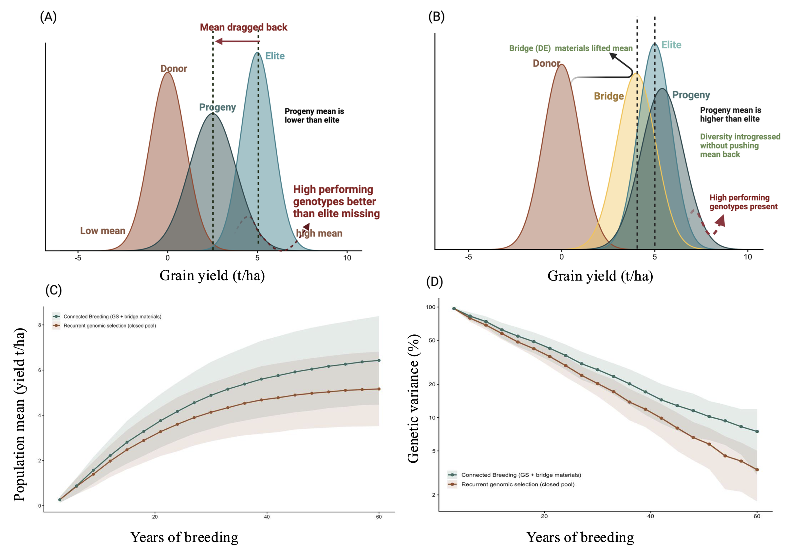

<div align="center">

<h1>Connected Breeding</h1>

<h3>A stochastic simulation of managed donor inflow into<br>recurrent genomic selection</h3>

<p>
  <em>Companion R code for </em><strong>An Integrated Framework to Develop and Deliver<br>
  Salt-Tolerant Rice Varieties for Coastal Ecologies</strong><em>, Plant Communications</em>
</p>

<p>
  
  
  
  
</p>

<br>



<p align="center">
  <sub>
    <b>The mechanism this code tests.</b>
    <b>(A)</b> Crossing elites directly to unadapted donors drags the progeny mean below the elite mean.
    <b>(B)</b> Routing the same donor alleles through elite-equivalent bridge (donor–elite) lines introgresses
    diversity without that penalty.
    <b>(C, D)</b> Simulated consequence over 20 three-year cycles: Connected Breeding sustains both
    genetic gain and additive genetic variance relative to a closed elite pool.
    Panels C and D are produced by the code in this repository; A and B are conceptual.
  </sub>
</p>

</div>

---

## The question

Recurrent genomic selection inside a closed elite pool converts standing variance into
gain very efficiently — and then runs out of variance to convert. **Connected Breeding**
adds a managed, mean-neutral inflow of donor diversity through elite-equivalent bridge
lines, so that new alleles enter the recycling pool without dragging the population mean
backwards.

The code here asks one question, and only one:

> Does a managed donor inflow sustain genetic gain and additive genetic variance
> better than recurrent genomic selection confined to a closed elite pool?

Everything in this repository exists to answer that, transparently and reproducibly.

<br>

## Scope — read this before interpreting any output

> [!IMPORTANT]
> Grain yield is modelled as a single, purely additive, highly polygenic trait (~1,000 QTL).
> **Salinity tolerance is not modelled.** This simulation therefore *cannot* test the
> Transition from Trait to Environment (TTE) design described in the paper.

<table>
<tr><th align="left" width="50%">Not in the model</th><th align="left" width="50%">In the model</th></tr>
<tr valign="top"><td>
<ul>
<li>No salinity-tolerance locus or tolerance sub-trait</li>
<li>No genotype-by-salinity interaction</li>
<li>No stage-specific tolerance (seedling / vegetative / reproductive)</li>
<li>No differential survival, mortality or phenotype truncation of
susceptible genotypes — precisely the phenomenon TTE is designed to
eliminate</li>
<li>No environmental covariate in the baseline scenario</li>
</ul>
</td><td>
<ul>
<li>A polygenic additive trait under recurrent selection</li>
<li>Genomic prediction with a sliding training window</li>
<li>Donor sampling at a fixed elite − donor differential</li>
<li>A standing bridge pool with an elite-equivalence admission bar</li>
<li>Genotype-by-environment interaction, in the sensitivity scenarios
only</li>
</ul>
</td></tr>
</table>

> [!NOTE]
> The baseline comparison is **not resource-neutral** and favours Connected Breeding by
> construction. `R/02_scenarios.R` defines the equal-budget, development-lag and
> cycle-time-penalty scenarios that remove that advantage.

<br>

## Requirements

```r
install.packages("AlphaSimR")   # >= 2.1.0
```

R ≥ 4.3 and [AlphaSimR](https://cran.r-project.org/package=AlphaSimR) are the only
requirements. Nothing else is needed; plotting uses base graphics.

> [!WARNING]
> **Determinism requires a single thread.** AlphaSimR parallelises recombination using
> per-thread random-number streams, so bit-for-bit reproducibility is only possible
> single-threaded. The scripts set `SP$nThreads <- 1L` and `OMP_NUM_THREADS=1`; do not
> override this if you need to reproduce published values exactly. Every run is
> additionally seeded per replicate.

<br>

## Repository contents

This repository contains **R source code only**. Figures, supplemental materials, and
simulated output are distributed with the article, not here.

| | File | What it does |
|:--|:--|:--|
| ⚙️ | [`R/01_functions.R`](R/01_functions.R) | Founder simulation, trait scaling, donor sampling, and the breeding-programme engines (`GSRS`, `CB`, `PSRS`, `MAGIC`) |
| 🎛️ | [`R/02_scenarios.R`](R/02_scenarios.R) | Baseline, sensitivity and resource-matched scenario definitions |
| ▶️ | [`R/03_run.R`](R/03_run.R) | Driver for the scenario grid; emits one record per cycle per scenario per replicate |
| ▶️ | [`R/04_run_strategies.R`](R/04_run_strategies.R) | Phenotypic recurrent selection and the one-time multi-parent resource |
| ▶️ | [`R/07_run_baseline.R`](R/07_run_baseline.R) | Additional replicates of the baseline pair alone, the contrast most worth replicating |
| 📊 | [`R/05_analyse.R`](R/05_analyse.R) | Paired contrasts, sensitivity summaries, and the late-horizon rate of gain |
| 📊 | [`R/06_summarise_strategies.R`](R/06_summarise_strategies.R) | Per-strategy summary across the compared breeding strategies |

Scripts are ordered by their numeric prefix: `01`–`02` define, `03`, `04` and `07`
execute, `05`–`06` summarise. Each locates its own bundle folder, so it runs correctly
whether called with `Rscript`, `source()`d, or sent from an editor.

<br>

## Design of the comparison

<table>
<tr><td width="34%"><b>Two strategies, paired</b></td><td>
Connected Breeding and closed-pool genomic recurrent selection are run on the
<b>same founder population under the same seed</b>, so every contrast is a paired
comparison and replicate-to-replicate founder variation cancels.
</td></tr>
<tr><td><b>Standing bridge pool</b></td><td>
Donor alleles enter through a recurrent, self-sustaining pool of donor–elite lines
rather than a one-shot batch, with within-family selection and distinct-family
admission so that inflow does not collapse to a single lineage.
</td></tr>
<tr><td><b>Genic, not total, variance</b></td><td>
Diversity is tracked as genic variance (Σ 2<i>pq a</i>²), which is immune to the
between-family structure that admixture temporarily induces in total genetic variance.
</td></tr>
<tr><td><b>Late-horizon slope</b></td><td>
The outcome that distinguishes a saturating from a non-saturating response is the
regression slope of cumulative gain on year over the final five cycles, not the
end-point alone.
</td></tr>
</table>

<br>

## Key parameters

All defaults live in `defaultParams()` in `R/01_functions.R` and correspond to the
parameter table in Supplemental File S1 of the article.

<table>
<tr><th align="left" colspan="2">Genome and trait</th></tr>
<tr><td width="42%">Genome</td><td>12 chromosomes × 1.2 Morgans (~1,440 cM)</td></tr>
<tr><td>QTL (grain yield)</td><td>~1,000 additive QTL (83 per chromosome)</td></tr>
<tr><td>Marker panel</td><td>1,200 SNPs (100 per chromosome)</td></tr>
<tr><td>Elite base mean</td><td>6.0 t ha⁻¹</td></tr>
<tr><td>Base additive variance</td><td>0.5 (t ha⁻¹)², i.e. 1 base σ<sub>A</sub> = 0.707 t ha⁻¹</td></tr>
<tr><td>Elite − donor differential</td><td>2.5 t ha⁻¹ (set by construction; see <code>makeFounders</code>)</td></tr>
<tr><td>Heritability (training phenotypes)</td><td>0.30</td></tr>
<tr><th align="left" colspan="2">Programme structure</th></tr>
<tr><td>Elite / donor founders</td><td>60 / 60</td></tr>
<tr><td>Crosses × progeny per cycle</td><td>30 × 40 (1,200 candidates)</td></tr>
<tr><td>Parents recycled per cycle</td><td>20</td></tr>
<tr><td>GS training set</td><td>200 lines per cycle, sliding window of 1,000 records</td></tr>
<tr><td>Elite-equivalent bridge lines per cycle</td><td>2</td></tr>
<tr><td>Cycle length / horizon</td><td>3 years × 20 cycles = 60 years</td></tr>
</table>

<details>
<summary><b>A note on the elite base variance</b> — why retention is expressed against the <i>elite</i> base</summary>
<br>
The trait is created with variance 1 in the <i>unselected</i> founder population and scaled
so that one base additive standard deviation equals 0.707 t ha⁻¹ (base additive variance
0.5). The elite pool is then produced by a burn-in of recurrent selection, which
necessarily depletes part of that variance; the realised elite additive variance at the
start of the comparison is therefore lower than 0.5, and is recorded per replicate as
<code>eliteVarObs</code>.
<br><br>
Variance retention is reported as a percentage of the <i>elite</i> base, which is the
quantity relevant to a breeding programme's remaining selection potential.
</details>

<br>

## Citation

If you use this code, please cite the article:

> Hussain, W., Anumalla, M., Catolos, M., Ramos, J., Sta. Cruz, M. T., Zhang, X.,
> Sreenivasulu, N., and Bhosale, S. **An Integrated Framework to Develop and Deliver
> Salt-Tolerant Rice Varieties for Coastal Ecologies.** *Plant Communications*.

<br>

## Licence

Released under the [MIT Licence](LICENSE).

<br>

<div align="center">
<sub>Maintained by <a href="https://github.com/whussain2">@whussain2</a> · International Rice Research Institute</sub>
</div>
